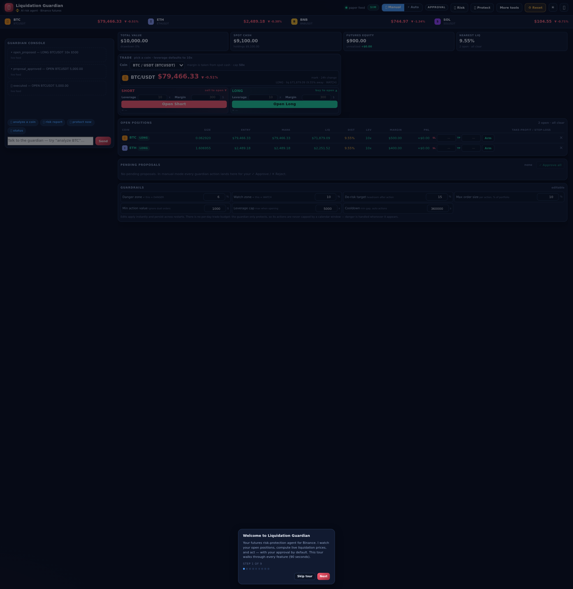
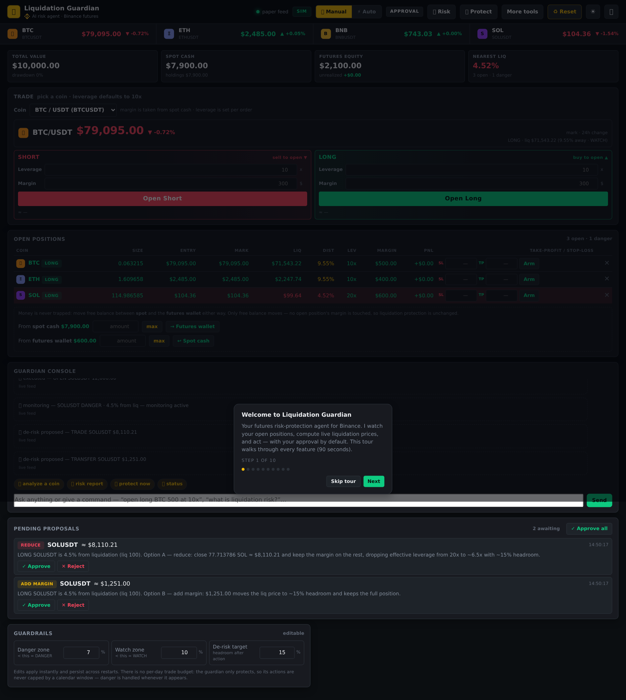
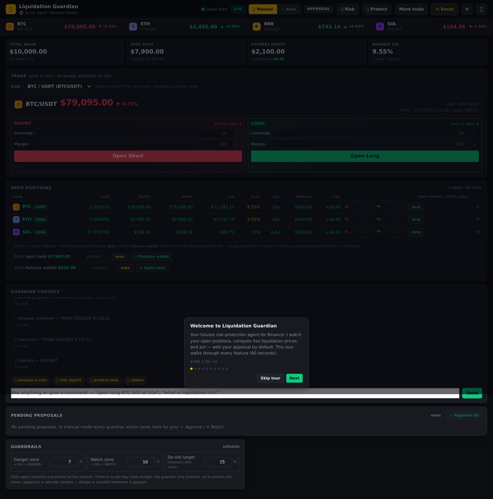
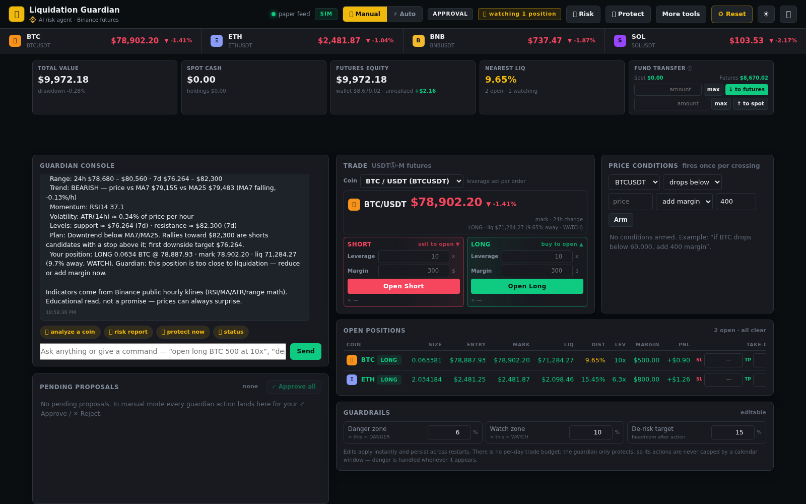

# Liquidation Guardian

A focused AI risk agent for [Binance Agent OS](https://www.binance.com/en/agent-os):
it watches open USDⓈ-M futures positions against live market data, computes the
real distance to each position's liquidation price, and proposes guardrailed
de-risk actions — reduce leverage or add margin — before the exchange
liquidates you. Intentionally narrow: a capital-protection agent for leveraged
futures, not a general-purpose trading bot.

## What this agent does

This project is designed around one clear job: protect leveraged futures
positions from liquidation risk.

- **Monitors liquidation risk in real time.** BTC / ETH / BNB / SOL update
  continuously from the market feed, and each open position is scored as
  OK / WATCH / DANGER based on its distance to liquidation.
- **Explains the safest next step.** When a position gets dangerous, the agent
  proposes the two standard protection paths: reduce exposure or add margin.
- **Applies guardrails before action.** Every action is checked against the
  symbol allowlist and cash/funds sufficiency — with nothing in the way that
  could freeze a de-risk: no per-day budget, order-size cap, cooldown, dust
  floor or leverage cap (all retired after proving decorative for protection).
- **An always-on guardian.** It watches every open position around the clock
  in *both* modes, logs risk-zone changes (OK → WATCH → DANGER) as they
  happen, and escalates the moment one reaches the danger zone: in manual
  mode it queues a de-risk plan for your approval; in automatic mode it
  executes it on its own — no prompt needed. Automatic mode engages only
  after a clear consent notice and still obeys all guardrails. A header badge
  shows how many positions it is watching.
- **Adds contextual analysis when useful.** A per-coin market read can help the
  operator understand trend, support/resistance, and whether risk should be
  reduced or preserved.
- **An editable, persistent risk profile — nothing decorative.** Three knobs
  remain (danger zone, watch zone, de-risk target) — the only thresholds that
  genuinely change what the guardian does — sanity-bounded and persisted across
  restarts. Everything else that used to look like a control (leverage cap, min
  action value, order-size, cooldown, daily budget) is gone.
- **Money flows both ways — nothing is trapped.** A funds control under the
  positions table moves free balance between **spot** and the **futures
  wallet** in either direction, by any amount you type (or all of it with
  `max`). A per-position `↩` releases excess margin off an open position,
  bounded so it keeps its de-risk headroom. Only free balance moves — no open
  position's margin is ever touched by the to/from control.
- **The console is a real command line, not a chat toy.** It sits directly
  above Pending Proposals so you can act fast. Beyond “risk report” /
  “status”, plain language drives the app: “open long BTC 500 at 10x”, “close
  BTC”, “close all my positions”, “add 200 margin to BTC”, “release margin on
  BTC”, “move 500 to futures”, “set danger zone to 5%”, “auto mode”. Set
  `OPENAI_API_KEY` (any OpenAI-compatible endpoint) and the same console
  becomes an open-ended agent: the model reads your live portfolio context,
  answers questions in plain English, and still routes every action through
  the same guardrailed propose-and-approve pipeline.
- **Price conditions fire once per crossing, never on a loop.** Arm “if BTC
  drops below 60,000, add 400 margin” and it triggers exactly once when price
  crosses, then re-arms only after price returns through the trigger — a coin
  that stays past the price can't spam the approval queue or drain cash in
  auto mode.

This scope is deliberate. The project is not trying to be a broad autonomous
trading system; it is an AI risk agent for futures protection and staged
execution planning.

## Why a "guardian" and not just an alert

A liquidation price is easy to compute; the hard part is what happens when you
get close to it. In a fast market, panic takes over — people average into a
losing position, add margin at the worst moment, or freeze. The guardian does
the math calmly and hands you a concrete, guardrailed plan with the numbers.
The agent is a risk manager, not a gambler.

## Quickstart

```bash
./run.sh        # macOS / Linux
run.bat         # Windows
```

or by hand: `pip install -r requirements.txt`, then
`python -m uvicorn app.main:app --port 8000`.

Open http://localhost:8000. The app starts in **sim mode** with a $10,000 paper
account priced off live Binance market data — no Binance account or credentials
needed to explore every feature. The identical agent loop runs against the real
Binance Agent OS when you switch to live (see below).

## Screenshots






Suggested first run (funding follows the Binance futures model):

1. **Fund the futures wallet first.** A fresh account holds all $10k in spot
   and nothing in the futures wallet. Margin is drawn from the futures wallet —
   never spot — so use the wallet control at the top right of the **Trade**
   panel to move some cash from spot → futures (e.g. $2,000). Opening or
   adding margin before depositing is refused with a clear “deposit from spot
   first” message.
2. In the **Trade** panel pick BTC and open a Long — say 20x with $600 margin.
   Liquidation sits ~4.5% away, so the guardian flags it DANGER immediately.
   (Blank leverage defaults to 10x.)
3. In the positions table, arm a **take-profit** and a **stop-loss**.
4. Hit **📈 Market analysis** and pick a coin for the deep read.
5. Say `protect my positions` — the guardian proposes reduce and add-margin.
6. Approve the reduce: liquidation jumps from ~4.5% to ~15% headroom. Closing
   a position or releasing margin you no longer need (per-row **↩** button)
   lands USDT back in the futures wallet — move it on to spot with the same
   wallet control whenever you like.
7. Open **Guardrails** and edit a limit — it applies instantly and persists
   across restarts. There's no trade-count budget to babysit; the guardian
   protects any hour of any day.
8. Try the **⚡ Auto** agent mode and read the consent notice before enabling.
   Let prices drift against your position: automatic mode de-risks it on its
   own, without you asking.

## Binance Agent OS / live mode

The same agent loop runs against the real Binance Agent OS MCP server —
`https://agent.binance.com/mcp/agentic` — through the official MCP Python SDK
(`app/adapters/mcp_live.py`). The adapter connects over streamable HTTP,
discovers the account and trade tools at runtime, and executes on a dedicated
**Agentic sub-account**, the isolation model Binance enforces: you fund the
sub-account manually, the agent has no withdrawal scope and can never pull
funds from your main account, and every non-read action goes through Binance's
confirm-before-execute flow.

Simulation is the default so the whole product runs with zero credentials and
zero real orders (paper fills at live prices). To trade live:

1. Create and fund an **Agentic sub-account** in Binance — the agent can only
   use funds already inside that sub-account.
2. `export RS_MODE=live` and start the app.
3. On first use the MCP client discovers Binance's OAuth authorization endpoint
   and opens the consent flow in your browser — or set `RS_MCP_ACCESS_TOKEN`
   to a pre-issued token to skip it. Approve the requested account/trade
   scopes, then confirm each order in Binance's confirm-before-execute screen.

The adapter logs the tools and scopes it discovers on startup, so you can
verify exactly what the live account exposes before placing any order. Start
with a small amount in the sub-account and work up.

## Scripts and tests

```bash
python -m pytest tests/ -q            # 89 unit tests, no network needed
python scripts/backtest.py --days 90  # guardian vs no-guardian on real klines
python scripts/demo.py                # scripted walkthrough of the agent loop
```

The backtest pulls hourly klines from the public feed, picks the worst 5-day
crash in the period, opens a leveraged long at the top, and compares: hold
(no guardian), guardian that cuts, guardian that adds margin. It shows
liquidations avoided and capital preserved.

## Project layout

```
app/
├── agent/          # risk engine (liq math), guardrails, narration, orchestrator
├── adapters/       # sim (paper) and MCP live execution
├── market/         # keyless Binance market-data client with TTL cache
├── api/            # FastAPI routes
└── static/         # single-file web UI (inline CSS/JS, no external assets)
scripts/            # backtest + scripted demo
tests/              # unit tests for the risk engine, features, and parsers
docs/               # architecture notes, screenshots
```

## Configuration

Everything is environment-driven — see `.env.example` for the full list. The
main knobs:

| Var | Default | Meaning |
|---|---|---|
| `RS_MODE` | `sim` | `sim` or `live` |
| `RS_LIQ_WARN_PCT` | `0.10` | distance to liq below this = WATCH |
| `RS_LIQ_DANGER_PCT` | `0.06` | distance to liq below this = DANGER → de-risk proposed |
| `RS_LIQ_TARGET_DIST_PCT` | `0.15` | de-risk until 15% headroom |
| `RS_TICKER_TTL` | `1` | live-ticker refresh interval in seconds |
| `RS_SYMBOL_ALLOWLIST` | BTC,ETH,BNB,SOL | empty = allow any symbol |
| `OPENAI_API_KEY` | — | optional: LLM narration + intent parsing |

Env vars are the boot defaults only. Edits made in the UI are persisted to
`data/guardrail_state.json`, so your profile survives restarts.

## Notes

- The liquidation math models isolated margin without fees or funding (see
  `app/agent/risk.py` for the derivation). The live adapter reads real
  positions from the MCP account scope, so live numbers come from Binance
  itself.
- A naive "close part of the position" does *not* move the liquidation price —
  margin is released proportionally. That's why the guardian's reduce keeps the
  released margin on the remainder (deleveraging). The backtest demonstrates
  this.
- The automatic agent still respects every guardrail, but guardrails cannot
  guarantee profit or prevent losses — the consent notice says so, on purpose.
- The optional LLM layer only rewrites narration and parses free-text intents.
  All decisions come from the deterministic engine.
- Not financial advice. Leveraged trading can liquidate your entire margin.
  The backtest is illustrative, not a strategy claim.

## License

MIT — see [LICENSE](LICENSE).
